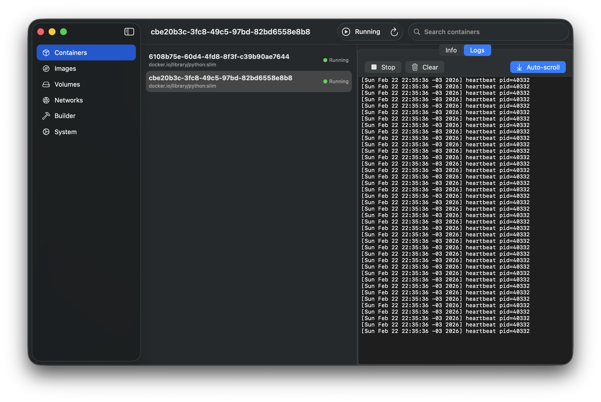

# Container GUI

A native macOS GUI for Apple's [`container`](https://github.com/apple/container) CLI tool. Built with SwiftUI, designed for Apple Silicon.



## Features

- **Containers** — List, inspect, start, stop, kill, delete. Live log streaming with auto-scroll.
- **Images** — Browse, inspect (config, platform, history), pull new images with streaming progress, delete.
- **Volumes** — List, inspect, create, delete.
- **Networks** — List, inspect, view IPv4/IPv6 configuration.
- **Builder** — View status, start/stop the buildkit instance.
- **System** — Disk usage overview, start/stop container services.

All actions provide instant feedback — the UI updates immediately, not on the next poll cycle.

## Requirements

- macOS 15+ (Sequoia)
- Apple Silicon
- [Apple `container` CLI](https://github.com/apple/container) installed

## Install

### Homebrew (recommended)

```bash
brew tap FeSens/tap
brew install --cask container-gui
```

This installs **Container GUI.app** into `/Applications`.

### Build from source

```bash
git clone https://github.com/FeSens/container-gui.git
cd container-gui
bash scripts/package-app.sh
# App is at .build/package/Container GUI.app
cp -r ".build/package/Container GUI.app" /Applications/
```

The app auto-detects the `container` CLI from `/opt/homebrew/bin/container`, `/usr/local/bin/container`, or your `$PATH`.

## Architecture

- **SwiftUI** with `NavigationSplitView` — 3-column layout for list/detail views, 2-column for singletons (Builder, System)
- **MVVM** with `@Observable` macro
- **Swift 6** strict concurrency — all services are `actor` types, ViewModels are `@MainActor`
- **Zero dependencies** — pure Swift + AppKit (for `NSTextView` log viewer)
- **CLI wrapper** — executes `container` commands via `Foundation.Process`, parses JSON output

## License

MIT
